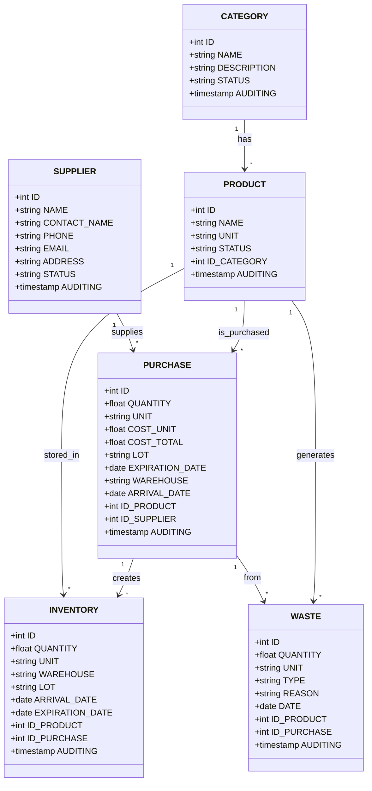

# api_store

# API REST Endpoints

## CATEGORY

### Endpoints
- `GET /api/categories` - Listar todas las categorías
- `GET /api/categories/{id}` - Obtener categoría por ID
- `POST /api/categories` - Crear nueva categoría
- `PUT /api/categories/{id}` - Actualizar categoría
- `DELETE /api/categories/{id}` - Eliminar categoría (soft delete)
- `GET /api/categories/{id}/products` - Listar productos de una categoría
- `PATCH /api/categories/{id}/status` - Cambiar estado de categoría

---

## PRODUCT

### Endpoints
- `GET /api/products` - Listar todos los productos
- `GET /api/products/{id}` - Obtener producto por ID
- `POST /api/products` - Crear nuevo producto
- `PUT /api/products/{id}` - Actualizar producto
- `DELETE /api/products/{id}` - Eliminar producto (soft delete)
- `GET /api/products/category/{categoryId}` - Productos por categoría
- `GET /api/products/{id}/inventory` - Ver inventario del producto
- `GET /api/products/{id}/purchases` - Historial de compras del producto
- `GET /api/products/{id}/waste` - Historial de mermas del producto
- `PATCH /api/products/{id}/status` - Cambiar estado del producto
- `GET /api/products/low-stock` - Productos con stock bajo

---

## SUPPLIER

### Endpoints
- `GET /api/suppliers` - Listar todos los proveedores
- `GET /api/suppliers/{id}` - Obtener proveedor por ID
- `POST /api/suppliers` - Crear nuevo proveedor
- `PUT /api/suppliers/{id}` - Actualizar proveedor
- `DELETE /api/suppliers/{id}` - Eliminar proveedor (soft delete)
- `GET /api/suppliers/{id}/purchases` - Compras realizadas al proveedor
- `PATCH /api/suppliers/{id}/status` - Cambiar estado del proveedor
- `GET /api/suppliers/active` - Listar proveedores activos

---

## PURCHASE

### Endpoints
- `GET /api/purchases` - Listar todas las compras
- `GET /api/purchases/{id}` - Obtener compra por ID
- `POST /api/purchases` - Registrar nueva compra
- `PUT /api/purchases/{id}` - Actualizar compra
- `DELETE /api/purchases/{id}` - Anular compra
- `GET /api/purchases/supplier/{supplierId}` - Compras por proveedor
- `GET /api/purchases/product/{productId}` - Compras por producto
- `GET /api/purchases/date-range` - Compras por rango de fechas (query params)
- `GET /api/purchases/expiring-soon` - Compras próximas a vencer
- `GET /api/purchases/{id}/inventory` - Ver inventario generado por compra
- `GET /api/purchases/warehouse/{warehouse}` - Compras por almacén
- `POST /api/purchases/{id}/receive` - Marcar compra como recibida

---

## INVENTORY

### Endpoints
- `GET /api/inventory` - Listar todo el inventario
- `GET /api/inventory/{id}` - Obtener registro de inventario por ID
- `POST /api/inventory` - Crear registro de inventario
- `PUT /api/inventory/{id}` - Actualizar inventario
- `DELETE /api/inventory/{id}` - Eliminar registro de inventario
- `GET /api/inventory/product/{productId}` - Inventario por producto
- `GET /api/inventory/warehouse/{warehouse}` - Inventario por almacén
- `GET /api/inventory/lot/{lot}` - Inventario por lote
- `GET /api/inventory/expiring-soon` - Inventario próximo a vencer
- `GET /api/inventory/expired` - Inventario vencido
- `PATCH /api/inventory/{id}/adjust` - Ajustar cantidad de inventario
- `GET /api/inventory/summary` - Resumen general del inventario
- `GET /api/inventory/valuation` - Valorización del inventario

---

## WASTE

### Endpoints
- `GET /api/waste` - Listar todas las mermas
- `GET /api/waste/{id}` - Obtener merma por ID
- `POST /api/waste` - Registrar nueva merma
- `PUT /api/waste/{id}` - Actualizar merma
- `DELETE /api/waste/{id}` - Eliminar registro de merma
- `GET /api/waste/product/{productId}` - Mermas por producto
- `GET /api/waste/type/{type}` - Mermas por tipo
- `GET /api/waste/date-range` - Mermas por rango de fechas
- `GET /api/waste/purchase/{purchaseId}` - Mermas de una compra específica
- `GET /api/waste/summary` - Resumen de mermas (totales, costos)
- `GET /api/waste/reasons` - Estadísticas por razón de merma

---

## REPORTS & ANALYTICS

### Endpoints Adicionales
- `GET /api/reports/inventory-turnover` - Rotación de inventario
- `GET /api/reports/top-suppliers` - Proveedores más frecuentes
- `GET /api/reports/top-products` - Productos más comprados
- `GET /api/reports/waste-analysis` - Análisis de mermas
- `GET /api/reports/cost-analysis` - Análisis de costos
- `GET /api/reports/expiration-tracking` - Seguimiento de vencimientos
- `GET /api/dashboard/summary` - Resumen del dashboard

---

## Query Parameters Comunes

- `page` - Número de página
- `limit` - Límite de resultados
- `sort` - Campo para ordenar
- `order` - Orden (asc/desc)
- `status` - Filtrar por estado
- `search` - Búsqueda por texto
- `startDate` - Fecha inicio
- `endDate` - Fecha fin