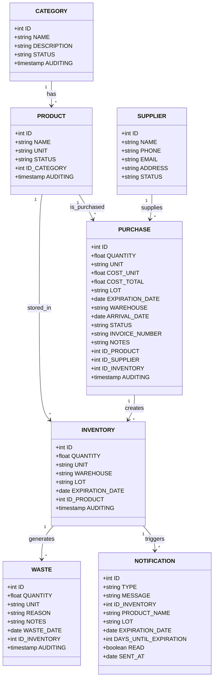

# 📦 API Store

Inventory management REST API — handles products, categories, suppliers, purchases, stock control, waste tracking and expiration notifications.

---

## Tech Stack

| Technology | Version |
|------------|---------|
| Java | 21 |
| Spring Boot | 4.0.2 |
| Spring Data JPA | 4.0.2 |
| Spring Validation | 4.0.2 |
| Spring WebSocket | 4.0.2 |
| PostgreSQL | Latest |
| Hibernate | 7.x |
| Lombok | 1.18.34 |
| MapStruct | 1.6.3 |
| SpringDoc OpenAPI | 2.8.4 |
| JaCoCo | 0.8.12 |
| H2 (testing) | Latest |
| JUnit | 6.0.2 |
| Mockito | 5.x |

---

## Entity Diagram

```mermaid
classDiagram
    class CATEGORY {
        +int ID
        +string NAME
        +string DESCRIPTION
        +string STATUS
        +timestamp AUDITING
    }
    class PRODUCT {
        +int ID
        +string NAME
        +string UNIT
        +string STATUS
        +int ID_CATEGORY
        +timestamp AUDITING
    }
    class SUPPLIER {
        +int ID
        +string NAME
        +string PHONE
        +string EMAIL
        +string ADDRESS
        +string STATUS
    }
    class INVENTORY {
        +int ID
        +float QUANTITY
        +string UNIT
        +string WAREHOUSE
        +string LOT
        +date EXPIRATION_DATE
        +int ID_PRODUCT
        +timestamp AUDITING
    }
    class PURCHASE {
        +int ID
        +float QUANTITY
        +string UNIT
        +float COST_UNIT
        +float COST_TOTAL
        +string LOT
        +date EXPIRATION_DATE
        +string WAREHOUSE
        +date ARRIVAL_DATE
        +string STATUS
        +string INVOICE_NUMBER
        +string NOTES
        +int ID_PRODUCT
        +int ID_SUPPLIER
        +int ID_INVENTORY
        +timestamp AUDITING
    }
    class WASTE {
        +int ID
        +float QUANTITY
        +string UNIT
        +string REASON
        +string NOTES
        +date WASTE_DATE
        +int ID_INVENTORY
        +timestamp AUDITING
    }
    class NOTIFICATION {
        +int ID
        +string TYPE
        +string MESSAGE
        +int ID_INVENTORY
        +string PRODUCT_NAME
        +string LOT
        +date EXPIRATION_DATE
        +int DAYS_UNTIL_EXPIRATION
        +boolean READ
        +date SENT_AT
    }

    CATEGORY "1" --> "*" PRODUCT : has
    PRODUCT "1" --> "*" INVENTORY : stored_in
    PRODUCT "1" --> "*" PURCHASE : is_purchased
    SUPPLIER "1" --> "*" PURCHASE : supplies
    PURCHASE "1" --> "*" INVENTORY : creates
    INVENTORY "1" --> "*" WASTE : generates
    INVENTORY "1" --> "*" NOTIFICATION : triggers
```

---

## Endpoints

### Categories `/api/categories`
| Method | Endpoint | Description |
|--------|----------|-------------|
| `GET` | `/{id}` | Get by ID |
| `GET` | `/page` | Paginated list |
| `GET` | `/page/status/{status}` | Filter by status |
| `POST` | `/` | Create |
| `PUT` | `/{id}` | Update |
| `DELETE` | `/soft-delete/{id}` | Soft delete |
| `PATCH` | `/{id}/status/{status}` | Change status |

### Products `/api/products`
| Method | Endpoint | Description |
|--------|----------|-------------|
| `GET` | `/{id}` | Get by ID |
| `GET` | `/page` | Paginated list |
| `GET` | `/category/{categoryId}` | By category |
| `GET` | `/search/name?name=` | Search by name |
| `GET` | `/status/{status}` | Filter by status |
| `POST` | `/` | Create |
| `PUT` | `/{id}` | Update |
| `DELETE` | `/soft-delete/{id}` | Soft delete |
| `PATCH` | `/change/status/{id}` | Change status |

### Suppliers `/api/suppliers`
| Method | Endpoint | Description |
|--------|----------|-------------|
| `GET` | `/{id}` | Get by ID |
| `GET` | `/page` | Paginated list |
| `GET` | `/search/name?name=` | Search by name |
| `GET` | `/search/status?status=` | Filter by status |
| `POST` | `/` | Create |
| `PUT` | `/{id}` | Update |
| `DELETE` | `/soft-delete/{id}` | Soft delete |
| `PATCH` | `/{id}/status` | Change status |

### Inventories `/api/inventories`
| Method | Endpoint | Description |
|--------|----------|-------------|
| `GET` | `/{id}` | Get by ID |
| `GET` | `/page` | Paginated list |
| `GET` | `/product/{productId}` | By product |
| `GET` | `/lot/{lot}` | By lot |
| `GET` | `/warehouse/{warehouse}` | By warehouse |
| `GET` | `/available` | All available stock |
| `GET` | `/available/product/{productId}` | Available stock by product |
| `GET` | `/expiration` | Expiring soon |
| `GET` | `/expiration/range?start=&end=` | By expiration range |
| `GET` | `/stock/product/{productId}` | Total stock by product |
| `GET` | `/stock` | Total stock all products |

### Purchases `/api/purchases`
| Method | Endpoint | Description |
|--------|----------|-------------|
| `GET` | `/{id}` | Get by ID |
| `GET` | `/page` | Paginated list |
| `GET` | `/product/{productId}` | By product |
| `GET` | `/supplier/{supplierId}` | By supplier |
| `GET` | `/purchase-date/range?start=&end=` | By date range |
| `POST` | `/` | Create |
| `PUT` | `/{id}` | Update |
| `PATCH` | `/{id}/status` | Change status |

### Wastes `/api/wastes`
| Method | Endpoint | Description |
|--------|----------|-------------|
| `GET` | `/page` | Paginated list |
| `GET` | `/{id}` | Get by ID |
| `GET` | `/by-reason?reason=` | Filter by reason |
| `GET` | `/by-date?start=&end=` | Filter by date range |
| `GET` | `/sumary` | Loss summary |
| `POST` | `/` | Register waste (deducts stock) |
| `DELETE` | `/{id}` | Delete waste (restores stock) |

### Notifications `/api/notifications`
| Method | Endpoint | Description |
|--------|----------|-------------|
| `GET` | `/page` | Paginated list |

---

## Summary

| Module | Total |
|--------|-------|
| Categories | 7 |
| Products | 9 |
| Suppliers | 8 |
| Inventories | 11 |
| Purchases | 8 |
| Wastes | 7 |
| Notifications | 1 |
| **Total** | **51** |